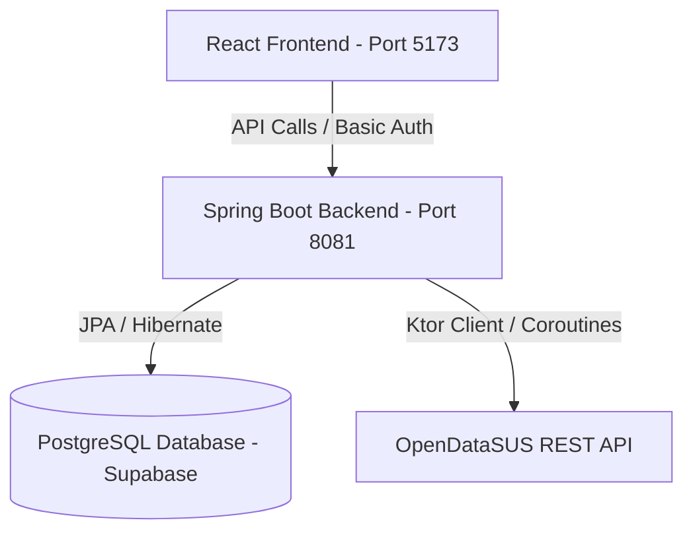

# SUS Attendance API (Foreigners) 🇧🇷🌐

A modern full-stack application designed to manage, import, and visualize SUS (Unified Health System) attendance data for foreigners in Brazil. 

This repository features a robust **Kotlin + Spring Boot** REST API connected to a live **PostgreSQL** database (via Supabase), paired with an interactive, responsive **React + TypeScript + Vite** administrative dashboard.

---

## 🏗️ Architecture & Component Overview



---

## ✨ Features

### 🖥️ Frontend (Admin Dashboard)
- **Interactive Statistics**: Real-time stats on total attendances, most active states, and dominant nationalities.
- **Dynamic State Filtering**: Filter metrics dynamically by Brazilian states.
- **Monthly Attendance Trends**: Beautiful interactive line chart representing monthly attendance volume over time.
- **Responsive Table View**: Comprehensive raw database table view.
- **On-Demand Data Import**: Trigger new imports from OpenDataSUS directly from the UI with custom batch sizes.

### ⚙️ Backend (REST API)
- **OpenDataSUS Integrator**: Core scheduled service that fetches and structures public health data using **Ktor Client** with asynchronous coroutines.
- **Realistic Statistical Distribution**: Algorithms mapping realistic state and nationality patterns to match demographic standards while preserving anonymity.
- **JPA Specifications**: Dynamic advanced filters on attendances.
- **Spring Security**: Secured endpoints using standard Basic Authentication.
- **Swagger Documentation**: Self-documented endpoints using OpenAPI/Swagger UI.

---

## 🛠️ Technology Stack

### Backend
* **Language:** Kotlin 2.1.0 (Java 22)
* **Framework:** Spring Boot 3.4.3
* **ORM:** Spring Data JPA (Hibernate)
* **Database:** PostgreSQL (Supabase Connection Pooler)
* **API Client:** Ktor Client 3.0.1 (CIO Engine)
* **API Docs:** Springdoc OpenAPI / Swagger UI 2.8.5
* **Security:** Spring Security (Basic Auth)
* **Build System:** Gradle Kotlin DSL

### Frontend
* **Language:** TypeScript
* **Framework:** React 19
* **Build Tool:** Vite 8
* **Styling:** Modern Custom Responsive CSS (Glassmorphism & animations)

---

## 🚀 Getting Started

### Prerequisites
- **Java 22** or higher installed.
- **Node.js** (v18+) and **npm** installed.

---

### 1. Backend Setup & Run

#### Database Configuration
The backend is configured to use a remote **Supabase PostgreSQL** connection pooler by default. Credentials are pre-configured in `src/main/resources/application.properties` for testing purposes:

```properties
spring.datasource.url=${DB_URL:jdbc:postgresql://aws-1-sa-east-1.pooler.supabase.com:6543/postgres?prepareThreshold=0}
spring.datasource.username=${DB_USERNAME:api_user.annrgvauosxpylyvjqiw}
spring.datasource.password=${DB_PASSWORD:SusApi2026!}
```
> [!NOTE]
> For production environments, it is recommended to override these configurations using the environment variables `DB_URL`, `DB_USERNAME`, and `DB_PASSWORD`.

#### Running the Backend
From the root directory, execute:

```bash
./gradlew bootRun
```
The server will start up on **port 8081** (http://localhost:8081).

---

### 2. Frontend Setup & Run

Navigate to the `frontend` folder, install dependencies, and start the development server:

```bash
cd frontend
npm install
npm run dev
```
The client will start up on **port 5173** (http://localhost:5173).

---

## 🔒 Security Configuration

The REST API endpoints are protected using HTTP Basic Authentication.
* **Username:** `admin`
* **Password:** `admin123`

The frontend dashboard is pre-configured with these credentials to automatically sign in all API requests using authorization headers.

---

## 📡 API Endpoints & Reference

All endpoints require the `Authorization` header with the Base64-encoded credentials.

| Method | Endpoint | Description | Query Parameters |
| :--- | :--- | :--- | :--- |
| **GET** | `/api/attendances` | Retrieve list of attendances | `year` (Int), `month` (Int), `country` (String), `state` (String) |
| **GET** | `/api/attendances/{id}` | Find a specific attendance record by ID | None |
| **POST** | `/api/attendances` | Create a new attendance manually | JSON Body (AttendanceRequest) |
| **DELETE** | `/api/attendances/{id}` | Delete an attendance record by ID | None |
| **POST** | `/api/attendances/import` | Trigger OpenDataSUS data import | `maxRecords` (Int, default: 100) |

### 📖 Swagger UI
When the backend is running, you can access the interactive API docs at:
👉 **[http://localhost:8081/swagger-ui/index.html](http://localhost:8081/swagger-ui/index.html)**

---

## 🤝 Git Contribution Workflow
For this personal project, commits must be signed and attributed to the personal profile:
- **Git User:** `joaopaulocosta551`
- **Email:** `kenocosta44@gmail.com`
